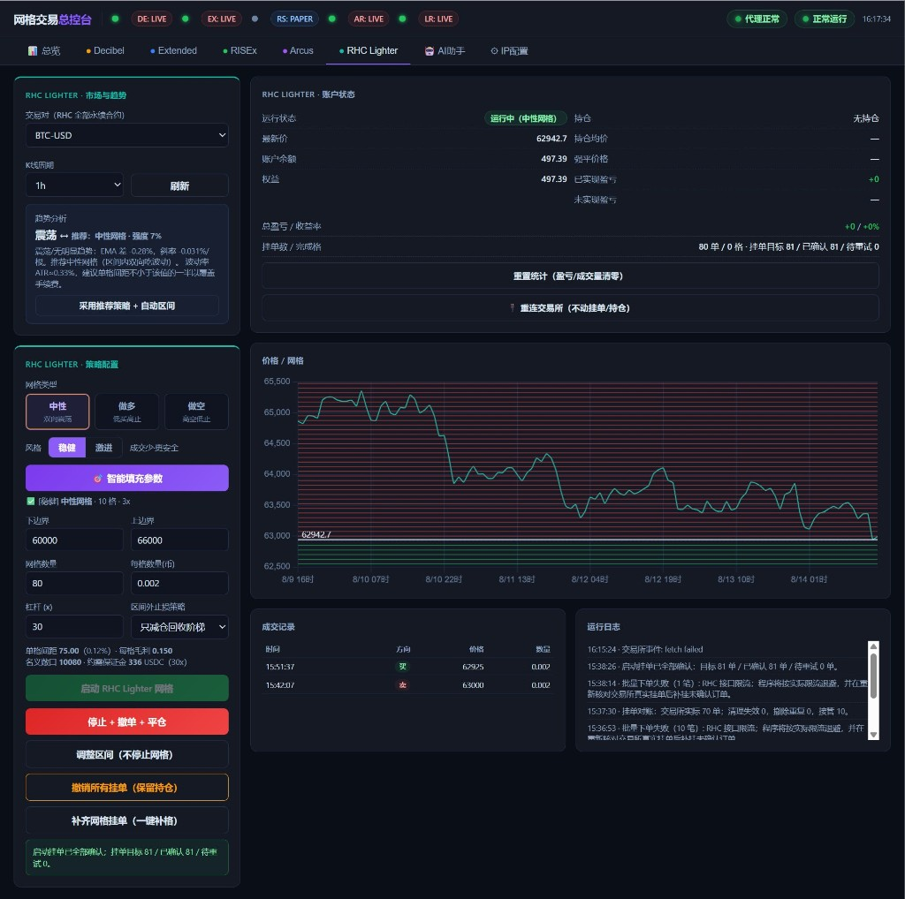

# dex-grid

面向 Web3 永续合约 DEX 的**多交易所网格交易系统**。

Go 单体后端，编译成**一个可执行文件**，Windows / Linux 双端运行。同一端口托管 **Web 控制台**（`go:embed`）与 REST API。`config.yaml` 只保存各 DEX 的密钥、监听端口与 IP 白名单；网格参数走控制台 / REST，也可选策略 YAML 作首次模板。默认**不会**自动开网格。



---

## 1. 核心模型

### 只做永续合约

所有策略都是**合约网格**：普通网格（做多 / 做空 / 中性）与马丁网格都带杠杆、都需要做空能力与 reduce-only 平仓腿。现货市场既没有杠杆也不支持这些语义，因此：

- 交易对选择列表里**只有永续合约**，现货由适配器在源头过滤掉
- 已下架（非活跃）的合约同样不出现在选择列表里，也不允许开新仓
- 已下架合约上如果还有仓位，只减仓的平仓单仍然放行，避免仓位被锁死

以 Lighter 主网为例：235 个市场里有 227 个永续、8 个现货（`ETH/USDC` 这类），其中 17 个永续已下架，最终可选的是 **210 个永续合约**。

### 一个 DEX 一个实例

这是贯穿全系统的最重要约束：

- 每个交易所**同时只运行一个网格实例**（Lighter 就只有一个 Lighter 实例）
- 一个实例同一时刻只跑**一个永续合约交易对、一套策略**（YAML 或 REST）

带来的简化：交易所连接与实例一一对应，无需并发下单，nonce 天然串行，`ClientOrderID` 里不需要实例槽位，状态存储不需要实例维度的分片。**这个约束换来了整个系统复杂度的大幅下降，不要轻易打破它。**

### 配置来源

| 来源 | 内容 | 变更方式 | 生效方式 |
| --- | --- | --- | --- |
| `config.yaml` | 各 DEX 的密钥、网络、代理、限流、日志、监听端口、IP 白名单、可选 `strategy_file` / `autostart` | 手工编辑文件 | 重启进程 |
| 策略 YAML（如 `config/lighter-sol.yaml`） | 交易对、网格类型、区间、格数、保证金、杠杆、风控 | 手工编辑文件 | 仅当 SQLite **还没有**该交易所策略时作为模板；已有控制台/API 配置不会覆盖 |
| SQLite / Web 控制台 / REST | 同上策略参数 | 页面保存或 `PUT /api/exchanges/{ex}/config` | 即时生效 |

密钥永远不进数据库，也不进策略 YAML。

---

## 2. 支持矩阵

| 交易所 | 阶段 | 状态 |
| --- | --- | --- |
| Lighter (zkLighter) | 第一阶段 | 已接入，可主网实盘 |

后续接入哪些 DEX 待定。架构上新增一个交易所只需实现 `exchange.Exchange` 接口并在 `main.go` 追加一行注册。

| 策略 | 标的 | 方向 | 阶段 | 状态 |
| --- | --- | --- | --- | --- |
| 普通合约网格 | 永续合约 | 做多 / 做空 / 中性 | 第一阶段 | 已实现 |
| 马丁合约网格 | 永续合约 | 做多 / 做空 | 第二阶段 | 已实现（控制台可切换） |

**不支持现货网格**，这是明确的设计边界而不是待办项。

### 建仓触发模式（三选一）

| 模式 | 说明 | 订单角色 |
| --- | --- | --- |
| 市价建仓 `market` | 立即以市价单完成建仓 | **taker** |
| Maker 自动跟价 `maker_follow` | 挂在订单簿买一档（做空时卖一档），价格移动则跟随改价 | maker |
| 指定价格 `limit_price` | 在指定价挂单等待成交 | maker |

> 除市价建仓外，系统中**所有**网格挂单一律 post-only。post-only 被拒（会立即成交）时重试或等下一 tick 重挂，绝不降级成 taker。

---

## 3. 架构总览

采用**轻量 DDD + 端口适配器**，四层：

```
┌───────────────────────────────────────────────────────────────┐
│  Web 控制台（embed）/ 策略 YAML / REST API                          │
└──────────────────────────┬────────────────────────────────────┘
                REST（同一端口，默认 0.0.0.0:8080）
┌──────────────────────────▼────────────────────────────────────┐
│  api  HTTP 层：路由 · 参数校验 · 命令下发 · IP 白名单               │
└──────────────────────────┬────────────────────────────────────┘
              命令 channel（阻塞等回执，保证单线程模型）
┌──────────────────────────▼────────────────────────────────────┐
│  app  应用层：实例 Runner · 执行器 · 建仓触发 · 对账 · 风控 · 行情分析 │
└───────┬──────────────────────────────────────┬────────────────┘
        │                                      │
┌───────▼──────────────────┐      ┌────────────▼─────────────────┐
│ domain 领域层（纯逻辑）    │      │ exchange 端口 + 适配器          │
│ 网格算法 · 策略状态机       │      │ Exchange 接口 · lighter/ ...  │
│ 订单 / 仓位 / 市场模型      │      │ Capabilities 能力协商          │
│ 零 IO、零第三方 SDK        │      └──────────────────────────────┘
└──────────────────────────┘
┌───────────────────────────────────────────────────────────────┐
│  infra  配置 · SQLite · 日志环形缓冲 · 指标 · 代理                 │
└───────────────────────────────────────────────────────────────┘
```

三条硬性依赖规则：

1. `domain` 不 import 任何其他内部包，也不做任何 IO —— 网格算法可被纯单元测试覆盖。
2. `app` 只依赖 `domain` 与 `exchange` 定义的**接口**，不依赖任何具体交易所包。
3. `api` 不直接操作策略状态，只能通过命令 channel 下发，由 Runner 在自己的 goroutine 里执行。

### 两个关键解耦点

**策略输出意图而非直接下单。** 策略处理事件后返回一组 `Action`（下单 / 改单 / 撤单 / 平仓 / 停止），由 `Executor` 翻译成交易所调用。策略因此 100% 可单测，交易所差异全部收敛在适配器。

**HTTP 请求不直接碰状态。** `POST /start`、`/stop`、`/adjust-range` 等把命令投进 Runner 的事件 channel 并等待回执。Runner 仍然是单 goroutine 顺序处理，HTTP 的并发不会破坏领域状态的一致性。

详见 [开发设计文档](docs/DESIGN.md)。Lighter 协议与改单见 [LIGHTER.md](docs/LIGHTER.md)。

---

## 4. 目录结构

```
dex-grid/
├── cmd/gridbot/main.go             # 入口：加载配置 → 注册适配器 → 恢复实例 → 启动 HTTP
├── internal/
│   ├── config/                     # config.yaml 结构体、环境变量展开、校验
│   ├── domain/                     # 领域层（纯逻辑，无 IO）
│   │   ├── market/                 # 精度模型、价格数量规整
│   │   ├── order/                  # 订单模型与状态机、ClientOrderID 编解码
│   │   ├── position/               # 仓位、均价、强平价估算
│   │   └── strategy/
│   │       ├── strategy.go         # Strategy 接口、Action、Event
│   │       ├── grid/               # 普通网格：价位生成 + 配对 + 状态机
│   │       └── martingale/         # 马丁网格：加仓计划 + 改止盈
│   ├── app/
│   │   ├── engine/                 # Runner：单 goroutine 事件循环 + 命令处理
│   │   ├── executor/               # Action → Exchange，批量/限流/重试
│   │   ├── entry/                  # 建仓触发器三种模式
│   │   ├── reconcile/              # 启动与周期性对账
│   │   ├── risk/                   # 止盈止损、区间外策略、熔断
│   │   └── analysis/               # K 线 → EMA/斜率/ATR → 趋势判定与参数推荐
│   ├── api/
│   │   ├── router.go               # REST 路由
│   │   ├── handlers.go             # 各端点
│   │   ├── stream.go               # WebSocket 实时推送
│   │   └── dto.go                  # 请求/响应结构体
│   ├── exchange/
│   │   ├── exchange.go             # Exchange 端口 + Capabilities
│   │   ├── registry.go             # 名称 → 构造函数
│   │   └── lighter/                # Lighter 适配器（REST + WS + 签名）
│   └── infra/
│       ├── store/                  # SQLite：策略配置、订单、成交、统计
│       ├── logx/                   # slog + 内存环形缓冲
│       ├── proxy/                  # HTTP/SOCKS5 代理与连通性探测
│       └── metrics/                # Prometheus
├── config/
│   ├── config.example.yaml         # 密钥与运维示例（复制为 config.yaml）
│   └── lighter-sol.yaml            # 可选 SOL 网格模板（需显式 strategy_file）
├── web/                            # 控制台静态页，由 go:embed 打进二进制
├── docs/
│   ├── DESIGN.md                   # 开发设计文档
│   ├── LIGHTER.md                  # Lighter 适配：协议、签名、nonce、改单
│   ├── GRID_CONFIG.md              # 网格配置文档
│   ├── DEPLOYMENT.md               # 安装部署文档
│   └── images/ui-prototype.png
├── scripts/                        # 构建与安装脚本（ps1 + sh）
├── go.mod
└── README.md
```

---

## 5. 快速开始

详细步骤（含服务化、代理、升级、备份）见 [安装部署文档](docs/DEPLOYMENT.md)。

```bash
# 1. 准备配置
cp config/config.example.yaml config/config.yaml
# 编辑 config.yaml，填 Lighter 的 account_index / api_key_index，密钥用环境变量

# 2. 注入密钥
export LIGHTER_ACCOUNT_INDEX=12345          # Windows: $env:LIGHTER_ACCOUNT_INDEX="12345"
export LIGHTER_API_KEY_PRIVATE_KEY=0x....

# 3. 构建并运行（默认不自动开网格）
go build -o gridbot ./cmd/gridbot            # Windows: go build -o gridbot.exe ./cmd/gridbot
./gridbot

# 4. 打开控制台（同源 API）
# http://127.0.0.1:8080/
curl -s http://127.0.0.1:8080/healthz
```

在页面里选交易对、填区间后点「启动」。无页面部署时在 `config.yaml` 打开 `strategy_file` 与 `autostart: true`。IP 白名单见 `server.ip_whitelist`。Linux 部署见 [安装部署文档](docs/DEPLOYMENT.md)。

### 命令行参数

| 参数 | 说明 |
| --- | --- |
| `-config` | 配置文件路径，默认可执行文件旁的 `config/config.yaml` |
| `-addr` | 覆盖 HTTP 监听地址 |

### lighterctl：适配器验证工具

除控制台外，也可用 `lighterctl` 直接核对账户与交易链路。所有会改变账户状态的操作都必须显式加 `-yes`，不加则只演练并打印参数。

```bash
go build -o lighterctl ./cmd/lighterctl

./lighterctl markets -q sol       # 交易对列表（下拉的数据源），支持关键字过滤
./lighterctl market -m 2          # 市场元数据、费率、最小下单量
./lighterctl book -m 2            # 盘口最优档
./lighterctl account              # 余额、权益、可用保证金
./lighterctl positions            # 非空持仓
./lighterctl orders -m 2          # 某市场的挂单
./lighterctl stream -m 2 -d 30s   # 订阅事件流，实时打印行情/订单/仓位
./lighterctl stream -m 2 -raw     # 打印原始 JSON 帧，用于排查协议问题
./lighterctl check                # 校验凭证（auth token + nonce）

./lighterctl maker -m 2 -side buy -qty 0.14 -offset 0.02   # 演练，不发送
./lighterctl maker -m 2 -side buy -qty 0.14 -offset 0.02 -yes
./lighterctl cancel -m 2 -coid <客户端订单号> -yes
./lighterctl taker -m 2 -side buy -qty 0.14 -yes
./lighterctl close -m 2 -yes
```

> `cancel-all` 必须带 `-m`，只撤销该交易对挂单，不影响其他市场。

---

## 6. 运行时操作

浏览器打开 `http://127.0.0.1:8080/`（与 API 同端口）。账户状态每秒刷新；价格/网格图默认 1 小时 K 线。页面数据始终对应当前策略交易对。

| 操作 | 端点 | 行为 |
| --- | --- | --- |
| 控制台 | `GET /` | 静态页 |
| 探活 | `GET /healthz` | 进程存活 |
| 写策略 | `PUT /api/exchanges/{ex}/config` | 写入 SQLite |
| 启动网格 | `POST /api/exchanges/{ex}/start` | 校验 → 建仓 → 铺网格 |
| 停止策略 | `POST /api/exchanges/{ex}/stop` | 撤销本交易对挂单，**保留仓位** |
| 调整区间 | `POST /api/exchanges/{ex}/adjust-range` | 全撤重铺到新区间，不停止实例 |
| 撤销挂单 | `POST /api/exchanges/{ex}/cancel-orders` | 只撤单，仓位不动 |
| 补齐挂单 | `POST /api/exchanges/{ex}/refill` | 看门狗同款：缺补、多撤 |
| 查看状态 | `GET /api/exchanges/{ex}/status` | 持仓、挂单、盈亏 |
| K 线 | `GET /api/exchanges/{ex}/klines` | 默认 `interval=1h` |

完整字段见 [网格配置文档](docs/GRID_CONFIG.md)。成交由交易所 WebSocket 推送后立刻翻转格子并挂对手单；`reconcile_interval`（默认 15s）只做挂单缺补/多撤兜底。

---

## 7. 运行时行为约定

1. **单实例单 goroutine**：一个交易所实例的所有事件（行情、成交回报、定时器、HTTP 命令）在同一 goroutine 顺序处理，领域状态无锁。
2. **命令走 channel**：HTTP handler 不直接改状态，投递命令并等回执，超时返回 504。
3. **意图幂等**：每笔订单携带确定性 `ClientOrderID`（编码交易所槽位 + 轮次 + 层级 + 用途 + 重挂序号），重放安全。
4. **启动先对账**：恢复运行前先拉交易所真实挂单与仓位比对，撤孤儿单、补缺失单。
5. **失败不静默**：错误按类型分流（可重试 / 参数错 / 保证金不足 / post-only 被拒），连续失败达阈值则熔断并写日志。
6. **停止只撤单**：停策略或关进程一律「撤销本交易对挂单 → 保留仓位 → 落盘终态」。仅止盈/止损会市价平仓。
7. **精度先规整后发送**：价格按 `tick_size`、数量按 `lot_size` 规整，规整后为 0 直接丢弃并告警。

---

## 8. 跨平台支持

| 项 | 做法 |
| --- | --- |
| 编译 | 纯 Go，**无 CGO**（SQLite 用 `modernc.org/sqlite`），可直接交叉编译 |
| 产物 | 纯 Go 静态二进制，部署只需可执行文件 + `config.yaml` + 策略 YAML |
| 路径 | 一律 `filepath.Join`，不硬编码分隔符；数据目录支持相对与绝对路径 |
| 服务化 | Linux 用 systemd，Windows 用计划任务或 NSSM，脚本都在 `scripts/` |
| 换行 | 仓库 `.gitattributes` 统一 LF，脚本按平台区分 `.sh` / `.ps1` |
| 信号 | Linux 处理 `SIGTERM`/`SIGINT`，Windows 处理 `os.Interrupt`，走同一套优雅退出逻辑 |

```bash
GOOS=linux   GOARCH=amd64 go build -o dist/gridbot     ./cmd/gridbot
GOOS=windows GOARCH=amd64 go build -o dist/gridbot.exe ./cmd/gridbot
```

---

## 9. 开发路线图

| 阶段 | 内容 | 产出 |
| --- | --- | --- |
| **M1 骨架** | 配置加载、日志、Exchange 接口与注册表、Strategy 接口、Runner 事件循环、dry-run 执行器、假交易所 | 全链路跑通 |
| **M2 网格算法** | 价位表生成、三方向配对逻辑、状态机、派生量纯函数 | 领域层单测覆盖 ≥ 80% |
| **M3 Lighter 适配** | REST/WS 客户端、签名、nonce、市场元数据、下单撤单、订单与仓位订阅 | 主网真实成交，已完成 |
| **M4 HTTP + 控制台** | REST + embed 静态控制台 | 页面可配置/启停/看状态与 1h 价格曲线 |
| **M5 建仓与风控** | 三种建仓模式、止盈止损、区间外策略、trailing、熔断 | 主网小资金实盘 |
| **M6 持久化与对账** | SQLite 落盘、启动恢复、周期漂移检查、指标 | 长时间无人值守 |
| **M7 行情分析** | K 线已接入图表；EMA/斜率/ATR、趋势判定、参数推荐待做 | 图表可用 |
| **M8 马丁网格** | 马丁策略（做多/做空）、预挂加仓、加仓后 Modify 止盈、控制台表单 | 已实现 |
| **M9 多交易所** | 接入第二个 DEX（具体交易所待定） | 验证端口抽象 |

**扩展性验收标准**：新增交易所只允许改 `internal/exchange/<name>/` 与 `main.go` 一行注册；新增策略只允许改 `internal/domain/strategy/<name>/` 与配置结构体。若必须改 `app` 层，说明抽象有缺陷，先修抽象。

---

## 10. 风险提示

永续合约带杠杆，**存在爆仓导致本金全部损失的风险**。网格策略在单边行情中持续逆势加仓，做多网格遇深度下跌、做空网格遇暴力拉升都会产生巨额浮亏。原型图里 30 倍杠杆只是示例，不是建议值。

- 先在测试网跑通完整流程
- 实盘从最小资金开始，**必须配置止损价**（区间外策略默认只是挂起等待回归，本身不构成保护）
- 使用逐仓模式，控制单实例风险敞口
- 密钥只通过环境变量注入，永远不提交到 Git
- 默认监听 `0.0.0.0:8080` 且无鉴权。公网部署请打开 `server.ip_whitelist` 或 Bearer Token，或不需要对外时改成 `127.0.0.1:8080`

---

## 11. 相关文档

- [开发设计文档 docs/DESIGN.md](docs/DESIGN.md) —— 分层职责、核心接口、网格算法、事件与命令流、API 契约、Lighter 适配、测试策略
- [网格配置文档 docs/GRID_CONFIG.md](docs/GRID_CONFIG.md) —— `config.yaml`、策略 YAML、REST 字段、派生量公式、校验规则
- [安装部署文档 docs/DEPLOYMENT.md](docs/DEPLOYMENT.md) —— Windows / Linux 安装、服务化、代理、升级、备份、排错
