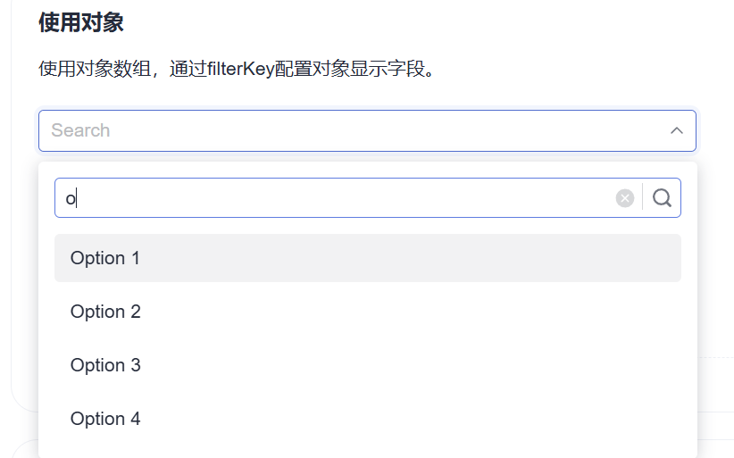

# dex-grid 网格配置文档

版本：v0.2

配置分两处，职责不重叠：

| | `config.yaml` | 策略 YAML / REST API（存 SQLite） |
| --- | --- | --- |
| 内容 | 各 DEX 密钥、网络、代理、限流、日志、监听端口、IP 白名单 | 交易对、网格类型、区间、格数、保证金、杠杆、建仓方式、风控 |
| 变更 | 手工编辑文件 | 控制台 / `PUT /config`；可选 `strategy_file` 仅作空库模板 |
| 生效 | 重启进程 | API/页面即时生效。`strategy_file` 不覆盖已保存配置；`autostart` 默认 `false` |
| 安全 | 密钥用环境变量注入 | 不含任何密钥 |

**每个 DEX 只有一个实例**，所以 `config.yaml` 里一个交易所一段配置，策略 YAML / REST 也按交易所名对应。

通用约定：

- 价格、数量、金额一律用**字符串**（如 `"2000.5"`），避免 YAML 与 JSON 解析成 float 丢精度。
- `${VAR}` 支持环境变量展开，密钥必须走环境变量。
- 时长用 Go duration 格式：`30s`、`5m`、`24h`、`28d`（`d` 由本项目扩展支持）。

---

# 第一部分：config.yaml

```yaml
app:      # 全局运行参数
server:   # HTTP API、鉴权、IP 白名单
proxy:    # 网络代理
exchanges: # 各 DEX 凭证与连接参数
```

## 1. app

| 字段 | 类型 | 默认 | 说明 |
| --- | --- | --- | --- |
| `log_level` | string | `info` | `debug` / `info` / `warn` / `error` |
| `log_format` | string | `json` | `json` / `text`。本地调试用 `text` |
| `log_file` | string | 空 | 日志文件路径，空则只输出到 stdout |
| `log_buffer_size` | int | `2000` | 页面日志面板的内存环形缓冲条数 |
| `data_dir` | string | `./data` | SQLite 与运行时文件目录。相对路径基于**可执行文件所在目录** |
| `tick_interval` | duration | `1s` | 定时事件间隔，驱动跟价、超时、止盈止损检查 |
| `reconcile_interval` | duration | `15s` | 运行中对照交易所挂单：缺失补挂、多余撤销。`0` 时引擎仍按 15s 跑 |
| `shutdown_timeout` | duration | `30s` | 优雅退出超时 |

## 2. server

| 字段 | 类型 | 默认 | 说明 |
| --- | --- | --- | --- |
| `addr` | string | `0.0.0.0:8080` | HTTP API 监听地址。`0.0.0.0` 对公网开放；只本机访问改成 `127.0.0.1:8080` |
| `auth.enabled` | bool | `false` | 是否启用 Bearer Token 鉴权。默认关闭，公网可直接访问 API |
| `auth.token` | string | — | 访问令牌，仅 `auth.enabled = true` 时必填，**用环境变量注入** |
| `metrics_enabled` | bool | `true` | 是否暴露 `/metrics` |
| `cors_origins` | []string | `["*"]` | 允许的跨域来源。`*` 表示任意 Origin；收紧时填具体地址 |
| `ip_whitelist.enabled` | bool | `false` | 是否只允许白名单 IP 访问 HTTP API |
| `ip_whitelist.allow` | []string | 空 | 单个 IP 或 CIDR。开启后本机 `127.0.0.1` / `::1` 始终放行 |

> 鉴权与 IP 白名单都是可选项，可单独或同时开启。未开启时任何人都能调用启动/停止等写接口。

## 3. proxy

国内网络访问部分 DEX 需要代理。连通性探测结果见 `GET /api/proxy`。

| 字段 | 类型 | 默认 | 说明 |
| --- | --- | --- | --- |
| `enabled` | bool | `false` | 总开关 |
| `url` | string | — | `http://127.0.0.1:7890` 或 `socks5://127.0.0.1:1080` |
| `username` / `password` | string | — | 代理认证，建议用环境变量 |
| `no_proxy` | []string | 空 | 绕过代理的主机列表 |
| `health_url` | string | 交易所 REST 根路径 | 连通性探测目标 |
| `health_interval` | duration | `60s` | 探测间隔，结果驱动页面状态灯 |

代理对 REST 与 WebSocket 同时生效。

## 4. exchanges

数组，每项一个交易所。**同一个 `name` 只能出现一次**（单实例约束）。

### 4.1 通用字段

| 字段 | 类型 | 默认 | 说明 |
| --- | --- | --- | --- |
| `name` | string | — | 交易所标识，当前仅 `lighter` |
| `enabled` | bool | `true` | 关闭后该交易所不启动、不加载策略文件 |
| `network` | string | `mainnet` | `mainnet` / `testnet` |
| `base_url` / `ws_url` | string | 按 network 推导 | 覆盖默认端点 |
| `rate_limit.rps` | int | `10` | 每秒请求数上限 |
| `rate_limit.burst` | int | `20` | 突发容量 |
| `timeout` | duration | `10s` | 单次 REST 超时 |
| `max_retries` | int | `3` | 可重试错误的最大重试次数 |
| `reconnect.initial` | duration | `1s` | WS 重连初始退避 |
| `reconnect.max` | duration | `30s` | WS 重连最大退避 |
| `strategy_file` | string | 空 | 网格参数 YAML 路径。仅当 SQLite 还没有该交易所策略时写入；已有配置不覆盖 |
| `autostart` | bool | `false` | `true` 时进程起来后自动开网格。有 Web 控制台时请保持 `false` |

### 4.2 Lighter 专有字段

| 字段 | 类型 | 默认 | 说明 |
| --- | --- | --- | --- |
| `credentials.account_index` | int | — | 账户索引（必填） |
| `credentials.api_key_index` | int | `1` | API Key 索引，0-254 |
| `credentials.api_key_private_key` | string | — | API Key 私钥（必填，**环境变量**） |
| `options.chain_id` | int | 按 network 推导 | 主网 `304` |
| `options.tx_send_channel` | string | `ws` | `ws`（低延迟，推荐）/ `rest` |
| `options.batch_enabled` | bool | `true` | 使用 `sendTxBatch` |
| `options.batch_size` | int | `20` | 单批最大交易数 |
| `options.order_expiry` | duration | `28d` | GTT 有效期，上限 `30d` |
| `options.price_protection` | bool | `true` | 市价单滑点保护 |

## 5. 完整示例

```yaml
app:
  log_level: info
  log_format: json
  data_dir: ./data
  tick_interval: 1s
  reconcile_interval: 15s
  shutdown_timeout: 30s

server:
  addr: "0.0.0.0:8080"
  auth:
    enabled: false
    token: ${GRIDBOT_TOKEN}
  metrics_enabled: true
  cors_origins: ["*"]
  ip_whitelist:
    enabled: false
    allow: ["127.0.0.1"]

proxy:
  enabled: false
  url: "http://127.0.0.1:7890"
  health_interval: 60s

exchanges:
  - name: lighter
    enabled: true
    network: mainnet
    credentials:
      account_index: ${LIGHTER_ACCOUNT_INDEX}
      api_key_index: ${LIGHTER_API_KEY_INDEX}
      api_key_private_key: ${LIGHTER_API_KEY_PRIVATE_KEY}
    options:
      tx_send_channel: ws
      batch_enabled: true
      batch_size: 20
      order_expiry: 28d
    rate_limit:
      rps: 10
      burst: 20
    # strategy_file: config/lighter-sol.yaml
    autostart: false
```

---

# 第二部分：策略参数（YAML 文件或 REST API）

网格参数优先走 **Web 控制台**（`http://127.0.0.1:8080/`）或 `PUT /api/exchanges/{ex}/config` 再 `POST .../start`。

无页面部署时，把参数写在 `config/lighter-sol.yaml` 这类文件里，并在 `config.yaml` 中设置：

```yaml
exchanges:
  - name: lighter
    strategy_file: config/lighter-sol.yaml
    autostart: true
```

进程启动会：若 SQLite 还没有该交易所策略则加载 YAML → 若 `autostart: true` 再自动开网格。已有控制台保存的配置不会被 YAML 覆盖。

仓库默认的 `config/lighter-sol.yaml`：SOL 做多、区间 72–77、25 格、保证金 1000、杠杆 10x，其余为系统默认。

以下参数在策略 YAML / JSON 中字段名相同。

## 6. 基础参数

| 表单项 | JSON 字段 | 类型 | 默认 | 说明 |
| --- | --- | --- | --- | --- |
| 交易对 | `symbol` | string | — | **永续合约**符号，如 `BTC`、`ETH`、`SOL`。选项来自 `GET /symbols`，现货与已下架合约不在其中 |
| 策略类型 | `strategy` | string | `grid` | `grid` / `martingale` |
| 网格类型 | `direction` | string | `neutral` | `neutral`（中性）/ `long`（做多）/ `short`（做空） |
| 杠杆 (x) | `leverage` | int | — | 1 - 市场上限 |
| 保证金模式 | `margin_mode` | string | `isolated` | `isolated`（逐仓，推荐）/ `cross`（全仓） |
| 风格 | `preset` | string | `stable` | `stable`（稳健）/ `aggressive`（激进）/ `safe`（成交少更安全）。仅影响「智能填充」的推荐值，不影响运行 |

## 7. grid —— 普通网格参数

| 表单项 | JSON 字段 | 类型 | 默认 | 说明 |
| --- | --- | --- | --- | --- |
| 下边界 | `lower_price` | string | — | **区间最低价** |
| 上边界 | `upper_price` | string | — | **区间最高价** |
| 网格数量 | `grid_count` | int | — | **格子数**，产生 `grid_count + 1` 条价格线与 `grid_count` 笔挂单。范围 2 - 4096 |
| 网格模式 | `spacing_mode` | string | `arithmetic` | `arithmetic`（等差）/ `geometric`（等比，第二阶段） |
| 数量输入方式 | `sizing_mode` | string | `per_grid_qty` | `per_grid_qty`（填每格数量，派生保证金）/ `margin`（填保证金，派生每格数量） |
| 每格数量 (币) | `per_grid_qty` | string | — | `sizing_mode = per_grid_qty` 时必填 |
| 保证金 (USDC) | `margin` | string | — | `sizing_mode = margin` 时必填 |
| 数量分配 | `qty_mode` | string | `equal_notional` | 仅 `sizing_mode = margin` 生效：`equal_notional`（每格金额相同）/ `equal_qty`（每格数量相同） |
| 网格随价格上移 | `trailing_up` | bool | `false` | 突破上沿后区间整体上移 |
| 网格随价格下移 | `trailing_down` | bool | `false` | 跌破下沿后区间整体下移 |
| 每次移动格数 | `trailing_step_grids` | int | `1` | |
| 移动触发缓冲 | `trailing_trigger_ticks` | int | `0` | 超出边界多少 tick 才触发，防边界抖动 |
| 最大移动次数 | `trailing_max_shifts` | int | `0` | `0` = 不限 |
| 移动冷却 | `trailing_cooldown` | duration | `30s` | 两次移动最小间隔 |
| 中性底仓比例 | `neutral_base_ratio` | string | `"0"` | 仅 `neutral` 生效，`0` = 不建仓 |
| 最大同时挂单数 | `max_active_orders` | int | `0` | 只挂近端 N 档，`0` = 全挂 |

## 8. entry —— 建仓触发参数

| 表单项 | JSON 字段 | 类型 | 默认 | 说明 |
| --- | --- | --- | --- | --- |
| 建仓方式 | `entry.mode` | string | `maker_follow` | `market` / `maker_follow` / `limit_price` |
| 指定价格 | `entry.price` | string | — | 仅 `limit_price` 必填 |
| 建仓超时 | `entry.timeout` | duration | `5m` | `market` 模式忽略 |
| 超时处理 | `entry.on_timeout` | string | `market` | `market`（转市价补齐）/ `keep`（继续等）/ `abort`（放弃并停止） |
| 成交容忍 | `entry.fill_tolerance` | string | `"0.01"` | 成交 99% 即视为完成 |

`mode = market`（唯一使用 taker 的场景）：

| 表单项 | JSON 字段 | 默认 | 说明 |
| --- | --- | --- | --- |
| 分片数 | `entry.slice_count` | `1` | 拆成几笔市价单降低冲击成本 |
| 分片间隔 | `entry.slice_interval` | `1s` | |
| 最大滑点 | `entry.max_slippage` | `"0.005"` | 0.5%，超出则中止剩余分片 |

`mode = maker_follow`（做多挂买一档，做空挂卖一档）：

| 表单项 | JSON 字段 | 默认 | 说明 |
| --- | --- | --- | --- |
| 跟价档位 | `entry.depth_level` | `1` | `1` = 买一/卖一 |
| 改价阈值 | `entry.reprice_ticks` | `1` | 最优价偏离超过 N 个 tick 才改价 |
| 改价最小间隔 | `entry.reprice_interval` | `500ms` | |
| 最大改价次数 | `entry.max_reprice` | `100` | 达到后按 `on_timeout` 处理，`0` = 不限 |

`mode = limit_price`：做多的 `price` 必须 ≤ 当前买一价，做空必须 ≥ 当前卖一价，否则 post-only 会被拒。保存时校验。

> **中性网格且 `neutral_base_ratio = 0`（默认）时初始目标仓位为 0，不需要建仓**，页面上建仓方式区域置灰并提示「中性网格无需建仓」。

## 9. risk —— 风控参数

| 表单项 | JSON 字段 | 类型 | 默认 | 说明 |
| --- | --- | --- | --- | --- |
| 止盈价 | `risk.take_profit_price` | string | — | 触及则撤单 + 市价平仓 + 停止 |
| 止损价 | `risk.stop_loss_price` | string | — | 同上。**强烈建议配置** |
| 区间外策略 | `risk.out_of_range` | string | `pause` | 见 9.1 |
| 触发价格源 | `risk.price_source` | string | `mark` | `mark`（标记价，抗插针）/ `mid` / `last` |
| 停止时平仓 | `risk.close_on_stop` | bool | `false` | **已废弃**。停策略与关进程一律只撤本交易对挂单、保留仓位；仅止盈/止损仍平仓 |
| 最大持仓名义 | `risk.max_position_notional` | string | `"0"` | 超出后暂停开仓腿，`0` = 不限 |
| 最低保证金率 | `risk.min_margin_ratio` | string | `"0"` | 低于则暂停开仓腿并告警，`0` = 不检查 |
| 连续失败熔断 | `risk.max_consecutive_errors` | int | `10` | 达到则撤单熔断，**不平仓** |
| 行情静默超时 | `risk.stale_timeout` | duration | `60s` | 超过则触发重连 |

### 9.1 区间外策略

价格运行到区间之外（跌破下边界或突破上边界）后的行为，两选一：

| 值 | 中文 | 行为 | 结束状态 |
| --- | --- | --- | --- |
| `pause` | **暂停网格，等待回归** | 不撤单、不平仓、不下新单。策略挂起，价格回到区间内后自动恢复正常网格逻辑 | `Paused(OutOfRange)` → 自动回到 `Running` |
| `stop_and_cancel` | **停止网格并撤销所有挂单** | 撤销本实例全部挂单，**仓位原样保留交给用户处理**，网格不再自动恢复 | `Stopped(OutOfRange)`，持仓保留 |

附加参数：

| 表单项 | JSON 字段 | 默认 | 说明 |
| --- | --- | --- | --- |
| 出界缓冲 | `risk.exit_buffer_ticks` | `0` | 超出边界多少个 tick 才算出界，防止边界抖动 |
| 回归确认时长 | `risk.resume_confirm` | `5s` | 仅 `pause` 生效：价格回到区间内并持续该时长才恢复 |

**`pause` 的语义细节**

- 已有挂单**全部保留**。做多网格跌破下沿时，买单本就已成交完毕，剩下的都是上方的平仓卖单，保留它们意味着价格反弹时能正常止盈。
- 暂停期间不产生任何新的交易意图：不补格、不 trailing、不响应成交后的配对逻辑（此时也不会有成交）。
- 页面状态显示为「暂停（价格超出区间）」，并标出当前价距最近边界的距离。
- 恢复时先做一次对账再转 Running，避免暂停期间交易所侧发生了本地未感知的变化。

**`stop_and_cancel` 的语义细节**

- 撤单后**不平仓**。这是有意的：区间外往往是最差的平仓时机，把决定权交给用户。
- 状态为 `Stopped(OutOfRange)`，页面醒目提示当前持仓、均价、浮亏与强平价，并提供「市价平仓」「重新配置区间后启动」两个后续操作入口。
- 不会自动恢复，即使价格随后回到区间内也不会。

> 区间外策略与止损价是两套独立机制，可以同时配置。止损价优先级更高（Guard 检查顺序 1、2 在区间外策略之前），触发止损会直接平仓停止。

### 9.2 止盈止损方向校验

| direction | 约束 |
| --- | --- |
| `long` | `stop_loss_price < lower_price < upper_price < take_profit_price` |
| `short` | `stop_loss_price > upper_price > lower_price > take_profit_price` |
| `neutral` | 两者都必须在区间之外，且分处两侧 |

不满足时保存失败，返回具体字段的错误信息。

## 10. reconcile —— 对账参数

| 表单项 | JSON 字段 | 默认 | 说明 |
| --- | --- | --- | --- |
| 仓位偏差容忍 | `reconcile.position_tolerance` | `"0.01"` | 1% 以内视为一致 |
| 自动纠偏 | `reconcile.auto_fix` | `false` | 超阈值时是否自动市价纠偏。`false` 则转 error 状态等人工确认 |
| 撤销孤儿单 | `reconcile.cancel_orphans` | `true` | 撤销属于本交易所但 epoch 已过期的挂单 |

运行中另有挂单看门狗（`app.reconcile_interval`，默认 15s）：对照交易所真实挂单，**本实例多余的撤掉、缺失的格子补挂**。解不出本系统 COID 的手工单不动。现价所在格若会穿价，仍跳过（不是漏单）。

## 11. order —— 挂单行为

| JSON 字段 | 默认 | 说明 |
| --- | --- | --- |
| `order.maker_tif` | `post_only` | **只允许 `post_only`**，其他值保存报错 |
| `order.post_only_retry` | `3` | post-only 被拒后的重挂次数上限（每 tick 一次） |
| `order.reduce_only_close` | `true` | 平仓腿带 reduce-only，防止反向开仓 |

---

# 第三部分：派生量与校验

## 12. 派生量公式

保存或预览配置时由**纯函数**计算（不依赖交易所连接，市场元数据作为入参），同时服务于页面实时预览与后端校验。

```
步长        step        = (upper − lower) / grid_count                    等差
                        = (upper / lower)^(1/grid_count)                  等比（比例）
价格线      P_i         = lower + i × step,  i = 0…grid_count
格子        cell_i      = [P_i, P_{i+1}],    i = 0…grid_count-1     共 grid_count 个

【sizing_mode = per_grid_qty】
每格数量    q           = per_grid_qty（所有格相同）
名义敞口    notional    = q × grid_count × 现价
所需保证金  margin_req  = notional / leverage

【sizing_mode = margin】
名义总额    notional    = margin × leverage
每格名义    notional_i  = notional / grid_count                           equal_notional
每格数量    q_i         = notional_i / P_i                                equal_notional
                        = notional / Σ P_i (i = 0…n-1)                    equal_qty

单格毛利    profit_i    = (P_{i+1} − P_i) × q_i
单格毛利率  rate_i      = (P_{i+1} − P_i) / P_i
单格净利    net_i       = profit_i − (P_i + P_{i+1}) × q_i × maker_fee_rate
强平价估算  liq_price   ← 按交易所维持保证金率与目标仓位计算
```

**页面实时预览**（对应原型图策略配置区下方两行文字）：

```
单格间距 75.00 (0.12%) · 每格毛利 0.150
名义敞口 10080 · 约需保证金 336 USDC (30x)
```

## 13. 校验规则

保存配置（`PUT /config`）与预览（`POST /preview`）走同一套校验，返回逐字段错误。

### 13.1 阻断性错误

| 规则 | 提示方向 |
| --- | --- |
| `lower_price > 0` 且 `upper_price > lower_price` | 区间非法 |
| `2 <= grid_count <= 4095` | 网格数越界 |
| 价格步长 `step` ≥ `tick_size` | 区间过窄或格数过多，提示最大可行格数 |
| 每格数量按 `lot_size` 规整后 > 0 | 数量过小，提示最小可行值 |
| `q × P_i >= min_notional`（对所有 i） | 单格名义低于交易所最小下单额 |
| `1 <= leverage <= 市场杠杆上限` | 杠杆越界 |
| `所需保证金 <= 账户可用余额` | 余额不足，显示差额 |
| **单格毛利率 > 双边 maker 费率 × 2** | 网格太密，无法覆盖手续费，提示最大可行格数 |
| 止盈止损与 `direction` 的方向关系（见 9.2） | 止盈止损方向错误 |
| `grid_count <= 交易所挂单上限` 或已设 `max_active_orders` | 超过挂单上限，建议设置挂单窗口 |
| `neutral_base_ratio ∈ [0, 1]` | 取值越界 |
| `order.maker_tif == post_only` | 只允许 post-only |
| `limit_price` 模式下建仓价与盘口方向关系 | post-only 会被立即拒绝 |

**手续费校验是最重要的一条**。原型图的趋势卡片专门提示「建议单格间距不小于波动率的一半以覆盖手续费」，而后端要做的是硬拦截：单格毛利率必须大于双边 maker 费率的 2 倍，否则网格越跑越亏。

### 13.2 警告（不阻断，页面黄色高亮）

| 规则 | 提示 |
| --- | --- |
| 开启 trailing 但未设 `stop_loss_price` | 追价无止损风险大 |
| `margin_mode = cross` | 建议使用逐仓隔离风险 |
| `leverage > 20` | 高杠杆，强平价距区间边界很近时额外提示具体数值 |
| 强平价落在网格区间内 | **区间未跑完就会强平**，这是致命配置，必须醒目提示 |
| `out_of_range = pause` 且无止损 | 价格长期不回归时仓位一直挂着，无任何保护 |
| 趋势分析方向与所选网格类型相反 | 例如下跌趋势中选做多网格 |

「强平价落在区间内」这条值得单独强调：用户填了 30 倍杠杆和一个很宽的区间时，价格根本走不到下沿就爆仓了。这个校验必须在保存时就算出来并展示。

## 14. 请求/响应示例

**保存配置**

```http
PUT /api/exchanges/lighter/config
Content-Type: application/json
```

```json
{
  "symbol": "BTC",
  "strategy": "grid",
  "direction": "neutral",
  "leverage": 30,
  "margin_mode": "isolated",
  "preset": "stable",
  "grid": {
    "lower_price": "60000",
    "upper_price": "66000",
    "grid_count": 80,
    "spacing_mode": "arithmetic",
    "sizing_mode": "per_grid_qty",
    "per_grid_qty": "0.002",
    "trailing_up": false,
    "trailing_down": false,
    "neutral_base_ratio": "0",
    "max_active_orders": 0
  },
  "entry": { "mode": "maker_follow", "depth_level": 1, "reprice_ticks": 1, "timeout": "5m", "on_timeout": "market" },
  "risk": {
    "out_of_range": "pause",
    "exit_buffer_ticks": 0,
    "resume_confirm": "5s",
    "price_source": "mark",
    "close_on_stop": false,
    "max_consecutive_errors": 10
  },
  "order": { "maker_tif": "post_only", "post_only_retry": 3, "reduce_only_close": true },
  "reconcile": { "position_tolerance": "0.01", "auto_fix": false, "cancel_orphans": true }
}
```

**预览响应**（`POST /preview`，页面实时调用）

```json
{
  "ok": true,
  "data": {
    "step": "75.00",
    "step_pct": "0.12",
    "grid_profit": "0.150",
    "grid_profit_rate": "0.12",
    "net_profit_after_fee": "0.098",
    "notional": "10080",
    "margin_required": "336",
    "leverage": 30,
    "initial_position": "0",
    "liquidation_price": "58210.4",
    "levels_preview": [
      { "index": 80, "price": "66000", "qty": "0.002", "role": "sell" },
      { "index": 79, "price": "65925", "qty": "0.002", "role": "sell" }
    ],
    "warnings": [
      { "code": "HIGH_LEVERAGE", "message": "30 倍杠杆下强平价 58210.4，距区间下沿 60000 仅 3.0%" }
    ]
  }
}
```

**校验失败响应**

```json
{
  "ok": false,
  "error": {
    "code": "GRID_TOO_DENSE",
    "message": "单格毛利率 0.038% 低于双边手续费 0.040% 的 2 倍，建议网格数不超过 24",
    "field": "grid.grid_count"
  }
}
```

---

# 第四部分：马丁网格参数（第二阶段）

`strategy = martingale`，`direction` 仅支持 `long` / `short`。

## 15. 字段总表

| 表单项 | JSON 字段 | 类型 | 默认 | 说明 |
| --- | --- | --- | --- | --- |
| 跌多少加仓 (%) | `martingale.add_drop_pct` | string | — | 做多是「跌 N%」，做空是「涨 N%」。`"2.0"` = 2% |
| 单周期止盈目标 (%) | `martingale.take_profit_pct` | string | — | 相对持仓均价。`"1.5"` = 1.5% |
| 初次下单保证金 | `martingale.initial_margin` | string | — | USDC |
| 加仓保证金 | `martingale.add_margin` | string | — | USDC，第一次加仓的基准金额 |
| 最大加仓次数 | `martingale.max_add_times` | int | — | 1 - 20 |
| 加仓金额倍数 | `martingale.add_multiplier` | string | `"1.0"` | 第 k 次加仓保证金 = `add_margin × add_multiplier^(k−1)` |
| 加仓间距基准 | `martingale.add_drop_mode` | string | `from_last` | `from_last`（距上次成交价）/ `from_avg`（距持仓均价） |
| 止盈后重开 | `martingale.cycle_restart` | bool | `true` | |
| 最大周期数 | `martingale.max_cycles` | int | `0` | `0` = 不限 |
| 预挂加仓单 | `martingale.preplace_adds` | bool | `true` | 提前把加仓单全部 post-only 挂出，反应更快 |

杠杆、保证金模式、建仓方式、风控参数与普通网格共用（第 6、8、9 节）。

## 16. 派生量

```
第 k 次加仓保证金   m_k          = add_margin × add_multiplier^(k−1),  k = 1…max_add_times
总保证金需求        M_total      = initial_margin + Σ m_k
总名义价值          N_total      = M_total × leverage
第 k 次加仓价格     P_k          = P_{k−1} × (1 − add_drop_pct/100)     做多，from_last
                                 = P_{k−1} × (1 + add_drop_pct/100)     做空，from_last
最大回撤覆盖        max_dd       = (P_0 − P_max) / P_0
周期止盈价          TP           = avg_price × (1 + take_profit_pct/100)  做多
加满仓强平价        liq_price    ← 按维持保证金率计算
```

页面保存时展示完整加仓计划表：

```
k | 触发价  | 保证金  | 名义    | 累计名义 | 持仓均价 | 止盈价  | 累计跌幅
0 | 2500.00 |   50.00 |  500.00 |   500.00 | 2500.00 | 2537.50 |  0.00%
1 | 2450.00 |   50.00 |  500.00 |  1000.00 | 2474.75 | 2511.87 |  2.00%
2 | 2401.00 |   75.00 |  750.00 |  1750.00 | 2443.31 | 2479.96 |  3.96%
3 | 2352.98 |  112.50 | 1125.00 |  2875.00 | 2405.42 | 2441.50 |  5.88%
4 | 2305.92 |  168.75 | 1687.50 |  4562.50 | 2360.34 | 2395.75 |  7.76%
5 | 2259.80 |  253.13 | 2531.25 |  7093.75 | 2307.90 | 2342.52 |  9.61%
6 | 2214.61 |  379.69 | 3796.88 | 10890.63 | 2247.62 | 2281.33 | 11.42%

总保证金需求 1089.07 USDC   加满仓强平价 2032.15（距首单 −18.7%）
```

## 17. 校验规则

| 规则 | 类型 |
| --- | --- |
| `0 < add_drop_pct < 50` | 阻断 |
| `take_profit_pct > 0` | 阻断 |
| `initial_margin > 0`、`add_margin > 0` | 阻断 |
| `1 <= max_add_times <= 20` | 阻断 |
| `0.1 <= add_multiplier <= 3.0` | 阻断 |
| `take_profit_pct > 双边手续费率之和` | 阻断：止盈无法覆盖手续费 |
| `M_total <= 账户可用余额` | 阻断：显示差额 |
| 每笔加仓名义 ≥ `min_notional` | 阻断 |
| `direction != neutral` | 阻断：马丁不支持中性 |
| `add_multiplier > 2.0` | 警告：资金需求指数增长 |
| 未设 `stop_loss_price` | 警告：马丁无天然止损，强烈建议配置 |
| 加满仓强平价距首单过近 | 警告：显示具体百分比 |

---

# 第五部分：配置变更与迁移

## 18. 运行中修改配置

| 场景 | 处理 |
| --- | --- |
| 实例 Stopped | 直接保存，下次启动生效 |
| 实例 Running，只改区间/格数/数量 | 用「调整区间（不停止网格）」：撤单重铺但**不平仓**，持仓按新目标补齐或减仓 |
| 实例 Running，改交易对/方向/策略类型 | 必须先停止策略（撤本交易对挂单、保留仓位），页面强制拦截并提示 |
| 实例 Running，改风控参数 | 直接生效，无需重启网格 |
| 实例 Paused | 可自由改配置，「补齐网格挂单」时按新配置铺单 |

## 19. config.yaml 变更

改 `config.yaml` 需要重启进程。重启后：

- 策略配置从 SQLite 恢复，不受影响
- 若某交易所被改为 `enabled: false` 而它当时处于 Running，**启动时会拒绝并提示**：需要先 `POST /stop` 再禁用，避免留下无人管理的挂单与仓位
- 若交易所凭证变更（换了 API Key），启动对账会发现挂单归属仍然有效（`ClientOrderID` 与账户绑定而非与 key 绑定），正常恢复

## 20. 前端表单映射

### 20.1 交易对下拉



交易对选择采用**可搜索下拉**：收起时是一个输入框，展开后面板顶部有搜索框，下方是过滤后的选项列表，`filterKey` 为 `symbol`。

这个组件形态是必需的而不是好看：Lighter 主网有 210 个可交易的永续合约，纯下拉根本没法用。

**列表里只有永续合约。** 系统的策略全都是合约网格，现货没有杠杆也不支持 reduce-only，因此后端在适配器层就把现货和已下架的合约滤掉了，前端拿到的就是可直接开仓的集合，不需要再做一遍过滤。

**数据源**：`GET /api/exchanges/{ex}/symbols`，返回 `MarketInfo` 数组。

```json
[
  { "symbol": "SOL", "market_index": 2, "type": "perp", "status": "active",
    "mark_price": "75.53", "max_leverage": 25, "daily_quote_volume": "23288002" }
]
```

**行为约定**

| 项 | 约定 |
| --- | --- |
| 标的范围 | 只有永续合约。现货与已下架合约由后端过滤，前端不必再判断 |
| 排序 | 后端已按 24 小时成交额降序返回，前端**不要重排**——活跃的排前面才好选 |
| 搜索 | 对 `symbol` 做不区分大小写的子串匹配 |
| 选项展示 | 主文本 `symbol`，副文本 `market_index · 标记价 · 最大杠杆` |
| 长列表 | 200+ 条需要虚拟滚动，否则展开会卡 |
| 选中后 | 立即拉取该市场的元数据与行情，并触发一次 `POST /preview` 刷新派生量 |
| 切换限制 | 实例处于 Running/Paused 时禁止切换交易对，必须先停止策略（撤单留仓） |

**页面已接入。** 命令行工具 `lighterctl` 仍可核对同一份市场数据：

```bash
lighterctl markets -q sol    # 按关键字过滤，等价于下拉里的搜索
lighterctl market -m 2       # 查看 market_index=2 的元数据与最小下单量
```

### 20.2 其余字段映射

| 后端结构 | 前端形态 |
| --- | --- |
| `GET /api/exchanges` | 已启用交易所列表与能力（控制台 Tab） |
| `GET /api/exchanges/{ex}/klines` | 1h K 线，价格/网格曲线 |
| `symbol` | 交易对可搜索下拉，见 20.1 |
| `direction` | 中性 / 做多 / 做空 三选一按钮组 |
| `preset` | 稳健 / 激进 / 成交少更安全 三选一 |
| `POST /suggest` | 「智能填充参数」与「采用推荐策略 + 自动区间」按钮 |
| `grid.*` | 数值输入组，每次 change 防抖 300ms 后调 `POST /preview` |
| `POST /preview` 响应 | 表单下方派生量文字 + 警告条 |
| `entry.mode` | 建仓方式三选一，选中后展开对应子表单；中性网格时整块置灰 |
| `risk.out_of_range` | 区间外策略二选一，选 `pause` 时展开回归确认参数 |
| 五个操作按钮 | 对应五个 POST 端点，`stop` 与 `adjust-range` 需二次确认弹窗 |

**设计要求**：校验与派生量计算必须是不依赖交易所连接的纯函数（市场元数据作为入参），这样 `POST /preview` 可以做到毫秒级响应，支持表单实时预览。
